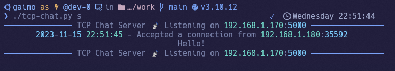
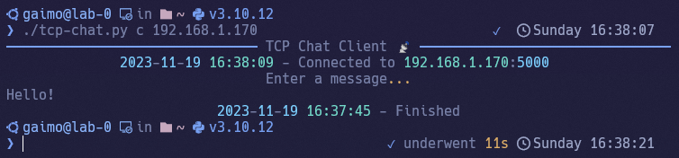

<div class="title" align="center">
<h1>
    📡 TCP-Chat
</h1>
<h2>
    Server
</h2>

<h2>
    Client
</h2>

</div>
<br>

---


# Usage

Run TCP Chat Server
```sh
./tcp-chat.py s
```

<br>

Select Network Interface (Default Network Interface is ens18)
```sh
./tcp-chat.py s -i {NIC}
```

<br>

Run TCP Chat Client
```sh
./tcp-chat.py c
```
