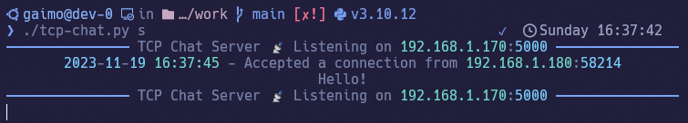

<div class="title" align="center">
<h1>
    📡 TCP-Chat
</h1>
<h2>
    Server
</h2>

<h2>
    Client
</h2>

</div>
<br>

---

# Required

```sh
pip install netifaces rich typer
```

<br>

# Usage

Run TCP Chat Server
```sh
./tcp-chat.py s
```

<br>

Specify the NIC (Default NIC is ens18)
```sh
./tcp-chat.py s {NIC}
```

<br>

Run TCP Chat Client
```sh
./tcp-chat.py c {IP address}
```
